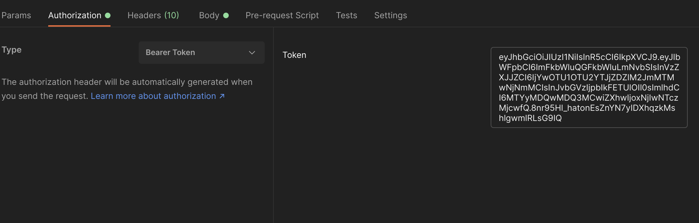
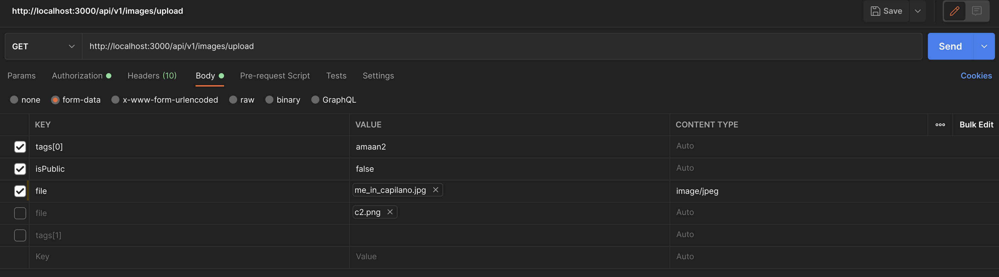

## Description

This is an Image Repository API built with NestJs (Typescript), MongoDB (Mongoose), and AWS S3 buckets for secure image storage.

---

## Table of Contents

-   [Features](#Features)
-   [SOLID](#SOLID)
-   [Setup](#Setup)
    -   [Without Docker](#Without-Docker)
    -   [Using Docker](#Docker)
-   [Environment](#Environment)
-   [Usage](#Usage)
    -   [Access Token](#Access-Token)
    -   [Image Upload](#Image-Upload)
-   [Endpoints](#Endpoints)
    -   [Public](#Public)
    -   [Protected](#Protected)
    -   [Admin only](#Admin-only)
-   [Testing](#Testing)

## Features

Shopify Backend Developer Internship Challenge Checklist

-   [x] SEARCH function
    -   [ ] from characteristics of the images
    -   [x] from text (using user submitted tags)
    -   [ ] from an image (search for similar images)
-   [x] ADD image(s) to the repository
    -   [x] one / bulk / enormous amount of images
    -   [x] private or public (permissions)
    -   [x] secure uploading and stored images
-   [x] DELETE image(s)
    -   [x] one / bulk / selected / all images
    -   [x] Prevent a user deleting images from another user (access control)
    -   [x] secure deletion of images
-   [ ] SELL/BUY images
    -   [ ] ability to manage inventory
    -   [ ] set price
    -   [ ] discounts
    -   [ ] handle money
-   [x] User Authentication
    -   [x] JSON Web Tokens (JWT)
    -   [ ] Refresh Tokens to improve JWT security
-   [x] User Authorization
    -   [x] Role-based authorization
    -   [x] Public/Protected/Admin Routes

[Back to Top](#Table-of-Contents)

---

## SOLID

Using Typescript (with NestJS) makes it easy to adhere to the SOLID design principles, as NestJS has a [Spring Boot](https://spring.io/) like architecture - using modules, controllers, services, guards, and DTOs.

Separating routing into controllers and data-fetching/storage/calculation logic into services make it easy to design modules that ensure the Single Responsibility Principle, and make classes easy to extend.

[Back to Top](#Table-of-Contents)

---

## Setup

### Without Docker

This will require that you have either MongoDB installed and running on your computer, or a free account on [MongoDB Atlas](https://www.mongodb.com/cloud/atlas) with a database instance created. Copy the connection string (URI) and paste it in `.env.example`.

If you have Docker and Docker-compose installed you can also use the [second method](#Docker).

-   Clone the repo, and then install dependencies using either npm

```bash
npm i
```

or yarn

```bash
yarn
```

The `ConfigService` uses environment variables found in a `.env` file in the root folder, so make sure to fill in the required variables in `.env.example` and then

```bash
cp .env.example .env
```

To start a development server on `localhost:3000` simply execute

```bash
yarn start:dev
```

or

```bash
npm run start:dev
```

### Docker

You can start 2 docker containers (the api and mongo) using the provided Dockerfile by executing

```bash
docker-compose up -d
```

This may take some time on first launch as it will pull the node and mongo images and install dependencies.

This will expose the API on `localhost:9001` and mongo on `localhost:27017`

[Back to Top](#Table-of-Contents)

---

## Environment

`ConfigService` loads the following environment variables to use in the app

**API_ENV** - either `dev` or `prod`, defaults to `dev`

**DB_URL** - URL of the MongoDB database

**JWT_SECRET_KEY** - secret key used to sign and decrypt the JSON Web tokens used for user authentication. Ideally a long random string

**JWT_EXPIRATION_TIME** - time that the issued access token is valid for. Defaults to 2 days (`2d`)

**AWS_S3_BUCKET** - The name of the AWS S3 bucket storage that the images should be stored on

**AWS_ACCESS_KEY_ID** - Access key ID that can be generated from the Management console -> Access keys

**AWS_SECRET_KEY** - Secret key generated along with the access key

[Back to Top](#Table-of-Contents)

---

## Usage

I recommend using Postman to send requests to the API:

### Access Token

-   The majority of the application is locked behind authentication which requires a valid JWT token.
-   Make an account/login to an existing one, by sending a `POST` request to either `/api/v1/user/register` or `/api/v1/user/login` respectively.
-   Copy the received `accessToken` into the Postman Authorization tab, select Bearer Token and paste the token on the right.



### Image Upload

-   To upload images, select the form-data option, and choose file in one of the key columns, and upload your image.
-   For each image uploaded, the endpoint expects a `tag` string. Due to Postman's limitations, multipart/form-data has an awkward syntax. Use tags[i] where i is the tag for the image i.
-   Also attach an `isPublic` boolean attribute for a request, indicating whether the images are public or private.



[Back to Top](#Table-of-Contents)

---

## Endpoints

### Public

```typescript
POST - "/api/v1/user/register"
req.headers["Content-type"]: "application/json"

POST - "/api/v1/user/login"
req.headers["Content-type"]: "application/json"
```

### Protected

All routes below need an authorization header
`req.headers["Authorization"]: "Bearer <TOKEN>"`

```typescript
POST - "/api/v1/images/upload"
req.headers["Content-type"]: "multipart/formdata"

PUT - "/api/v1/images/:id"
req.headers["Content-type"]: "application/json"

DELETE - "/api/v1/images/:id"

GET - "/api/v1/images/"

GET - "/api/v1/images/id/:id"

GET - "/api/v1/images/tag/:tag"
```

### Admin Only

This route does not serve much purpose but it showcases role based routes - only users with a `roles` property that includes `'ADMIN'` are authorized to access this path

```typescript
GET - '/api/v1/images/all';
```

[Back to Top](#Table-of-Contents)

---

## Testing

Tests are included inside their respective modules and end with a `*.spec.ts`.

Authentication and User routing (controller) tests are part of the End-to-end tests in the `test/app.e2e-spec.ts` file.

```bash
# Using docker

    # unit tests
    $ docker exec -it api yarn test
    # end to end
    $ docker exec -it api yarn test:e2e

# Without docker

    # unit tests
    $ npm run test
    # end to end tests
    $ npm run test:e2e
```
